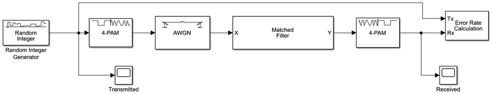
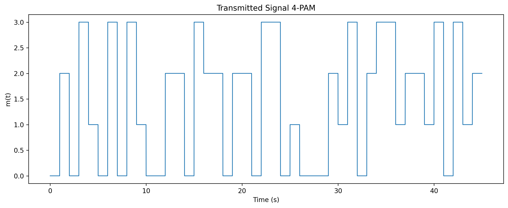
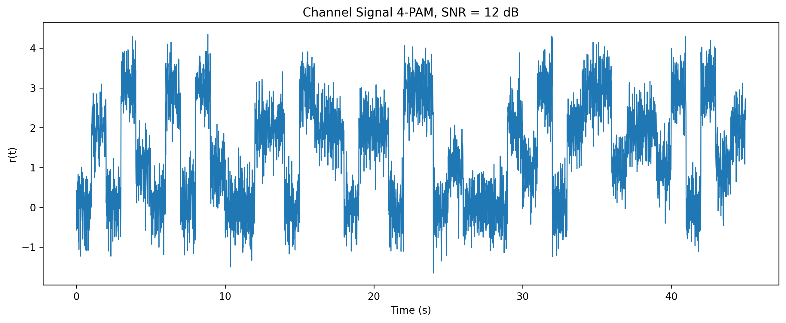
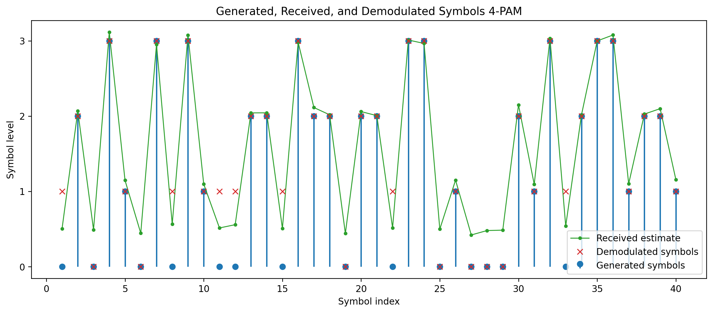
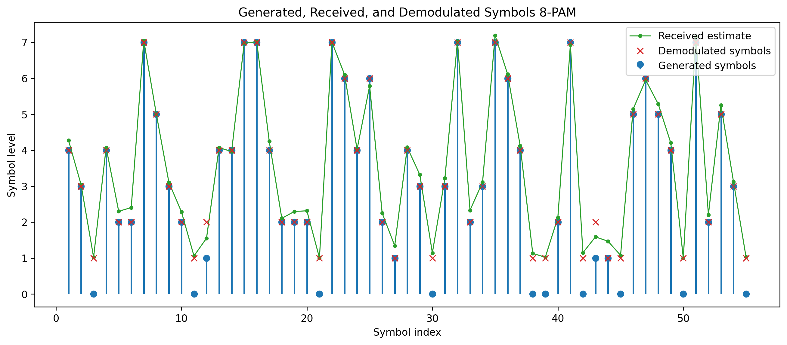
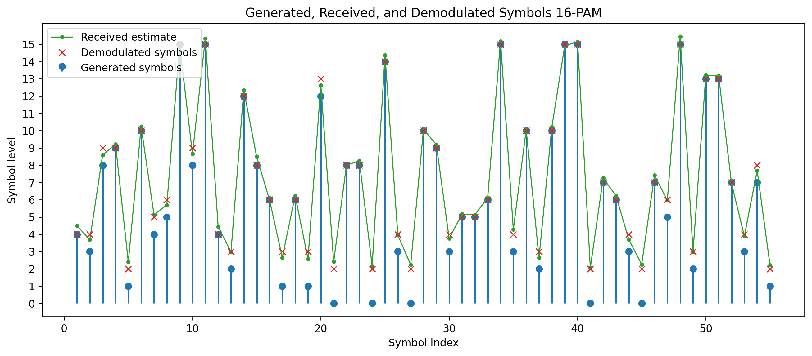
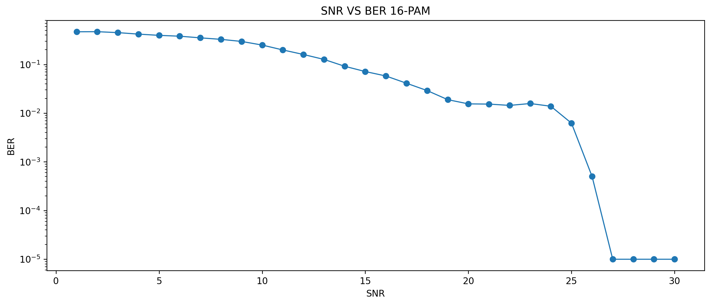
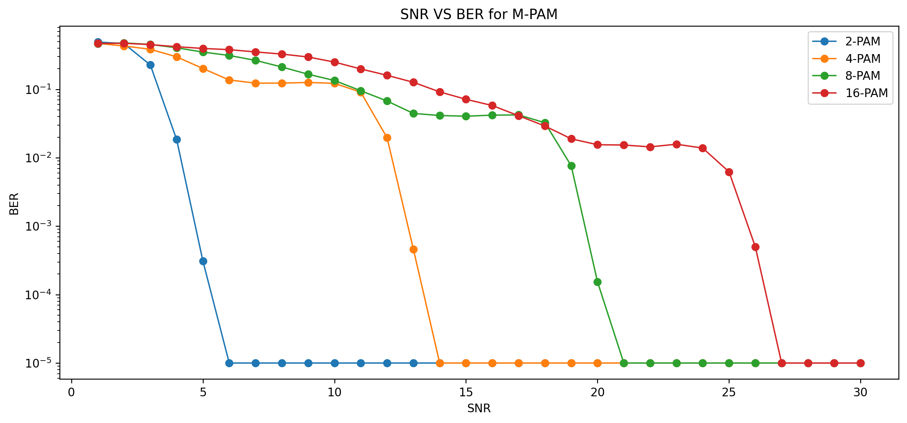

# M-Pulse Amplitude Modulation

M-Pulse Amplitude Modulation Matlab and Simulink project simulates the Pulse Amplitude Modulation over AWGN channel. The project studies the M-PAM behaviour for different modulation orders. The main MATLAB implementation deals with 16-PAM, matched-filter style receiver processing, symbol reconstruction and SNR versus BER analysis.

## Preview



The communication chain is represented by a Simulink model with random symbol generation, PAM modulation, AWGN channel modeling, matched filter, demodulation and error-rate calculation.



The transmitted signal is represented as a sequence of rectangular pulses, where each pulse level corresponds to a PAM symbol.



The AWGN channel adds noise to the transmitted signal before the receiver stage.



The receiver estimates the transmitted symbols and rounds the received amplitudes back to valid PAM levels.



With higher modulation order, the symbol levels become closer together and the system becomes more sensitive to noise.



The main MATLAB implementation focuses on the 16-PAM case and compares generated, received, and demodulated symbols.



The 16-PAM BER curve shows the decrease in error rate as SNR increases.



The comparison curve shows the general trend that larger PAM orders are more sensitive to noise.

## Main Features

* MATLAB simulation of M-Pulse Amplitude Modulation
* AWGN channel modeling
* Matched-filter-style receiver processing
* Symbol rounding and clipping for demodulation
* Bit reconstruction and BER calculation
* SNR-versus-BER plotting
* Simulink model

## Technical Overview

The main MATLAB script is:

```text
Code.m
```

The Simulink model is:

```text
Simulink.slx
```

The MATLAB script defines the order of PAM, determines the number of bits per symbol as `log2(M)`, generates a random binary message, segments the bits into symbols, and converts each group of bits from binary to decimal amplitude levels.

At the transmitter, each symbol is mapped to a rectangular pulse by repeating the symbol amplitude over the pulse interval. The channel adds AWGN of different SNR values. At the receiver, the signal is split into pulse segments, each segment is processed by a matched-filter-style convolution/energy estimate, and the resulting amplitude estimate is rounded back to the nearest PAM level.

Finally, the received symbols are converted to bits and compared with the original message to find out the error behavior as a function of SNR values. The report also includes BER curves for 2-PAM, 4-PAM, 8-PAM and 16-PAM based on Simulink.

## How to Run

1. Open MATLAB.
2. Open the project folder.
3. Run the MATLAB script:

```matlab
Code
```

4. MATLAB will generate the SNR-versus-error plot for the 16-PAM simulation.
5. Open `Simulink.slx` in Simulink to inspect the block-diagram model.

## Limitations

The main MATLAB script is for the 16-PAM case and makes use of a simple receiver implementation in the style of a matched-filter. The value in the original script plotted is obtained from the number of bit mismatches over the simulated message and so the best way to read the result is as an SNR vs BER trend.
