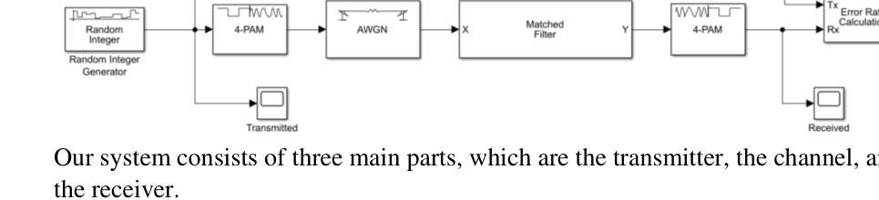
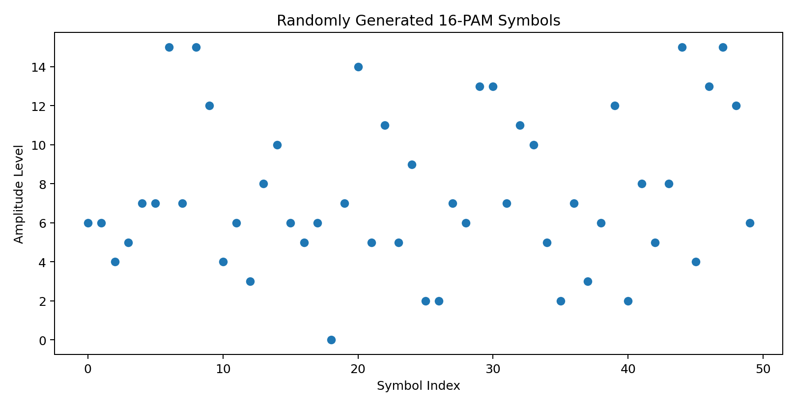
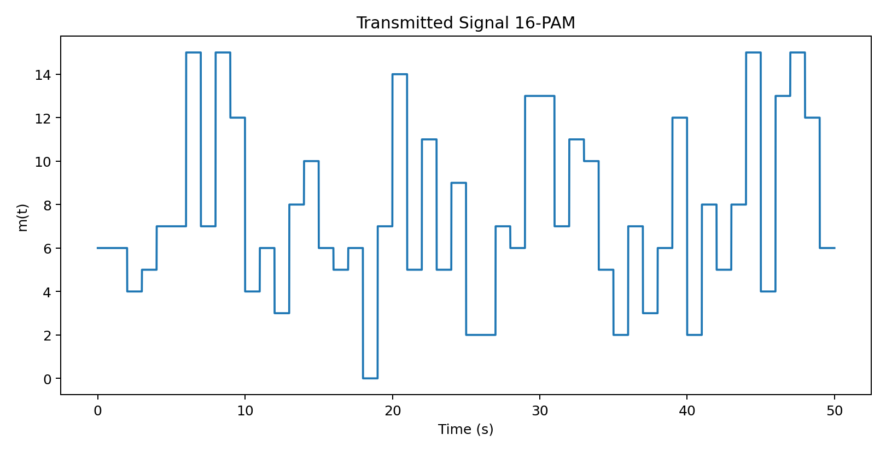
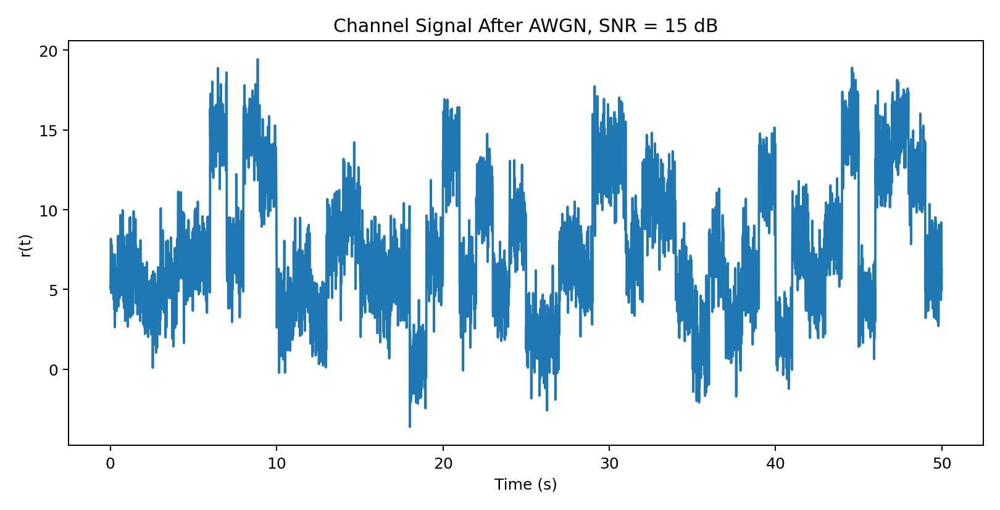
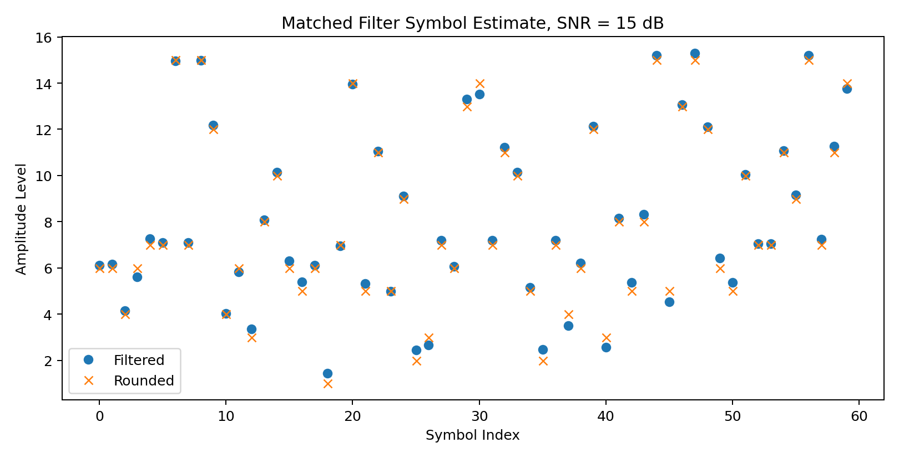
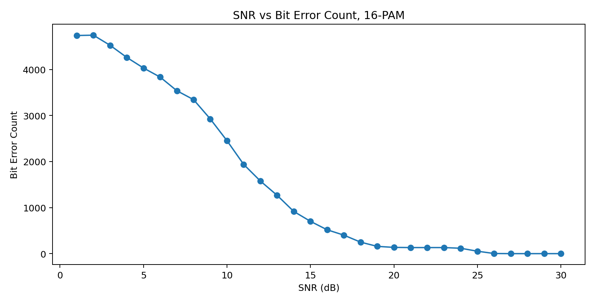
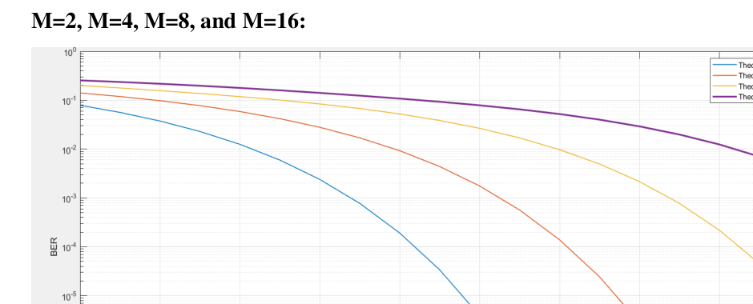

# M-Pulse Amplitude Modulation

M-Pulse Amplitude Modulation is a MATLAB and Simulink project that simulates Pulse Amplitude Modulation over an AWGN channel. The project studies M-PAM behavior for different modulation orders, with a main MATLAB implementation focused on 16-PAM, matched filtering, symbol reconstruction, and SNR-versus-error analysis.

## Preview



The report models the communication system as a transmitter, AWGN channel, matched filter, demodulator, and error-rate calculation stage.



The MATLAB script starts by generating random bits, grouping them into symbols, and mapping each group to a PAM amplitude level.



The modulated message is represented as a train of rectangular pulses, with each symbol repeated across the pulse duration.



The channel stage adds white Gaussian noise to the transmitted signal before receiver-side processing.



At the receiver, each pulse segment is processed through a matched-filter-style energy estimate, rounded, and clipped back to the valid symbol range.



The script evaluates the effect of SNR on the bit-error count for the 16-PAM case.


The comparison plot shows the expected trend: higher SNR generally reduces the error count, while larger PAM orders are more sensitive to noise.



The report also includes Simulink-based BER/SNR curves for multiple PAM orders.

## Main Features

* MATLAB simulation of M-Pulse Amplitude Modulation
* Random bit generation and bit-to-symbol grouping
* 16-PAM rectangular pulse construction
* AWGN channel modeling
* Matched-filter-style receiver processing
* Symbol rounding and clipping for demodulation
* Bit reconstruction and error-count calculation
* SNR-versus-error plotting
* Simulink model and report included for the course project

## Technical Overview

The main MATLAB script is:

```text
Code.m
```

The Simulink model is:

```text
Simulink.slx
```

The MATLAB script defines `M = 16`, computes the number of bits per symbol as `log2(M)`, generates a random binary message, groups the bits into symbols, and converts each group from binary to decimal amplitude levels.

The transmitter converts each symbol into a rectangular pulse by repeating the symbol amplitude over the pulse duration. The channel uses AWGN to add noise at different SNR values. At the receiver, the signal is divided into pulse segments, each segment is processed through a matched-filter-style convolution/energy estimate, and the resulting amplitude estimate is rounded back to the nearest PAM level.

Finally, the received symbols are converted back to bits and compared against the original message to calculate the error count across SNR values.

## How to Run

1. Open MATLAB.
2. Open the project folder.
3. Run the MATLAB script:

```matlab
Code
```

4. MATLAB will generate the SNR-versus-error plot for the 16-PAM simulation.
5. Open `Simulink.slx` in Simulink to inspect the block-diagram model used for the report simulations.

## Limitations

The main MATLAB script focuses on the 16-PAM case and uses a simple matched-filter-style receiver implementation. The plotted value is based on the number of bit mismatches across the simulated message rather than a normalized BER value, so the result is best interpreted as an SNR-versus-error-count trend.

The project is a course simulation and does not implement a full communications-system toolbox, coding scheme, pulse-shaping design, or optimized demodulator for deployment.
